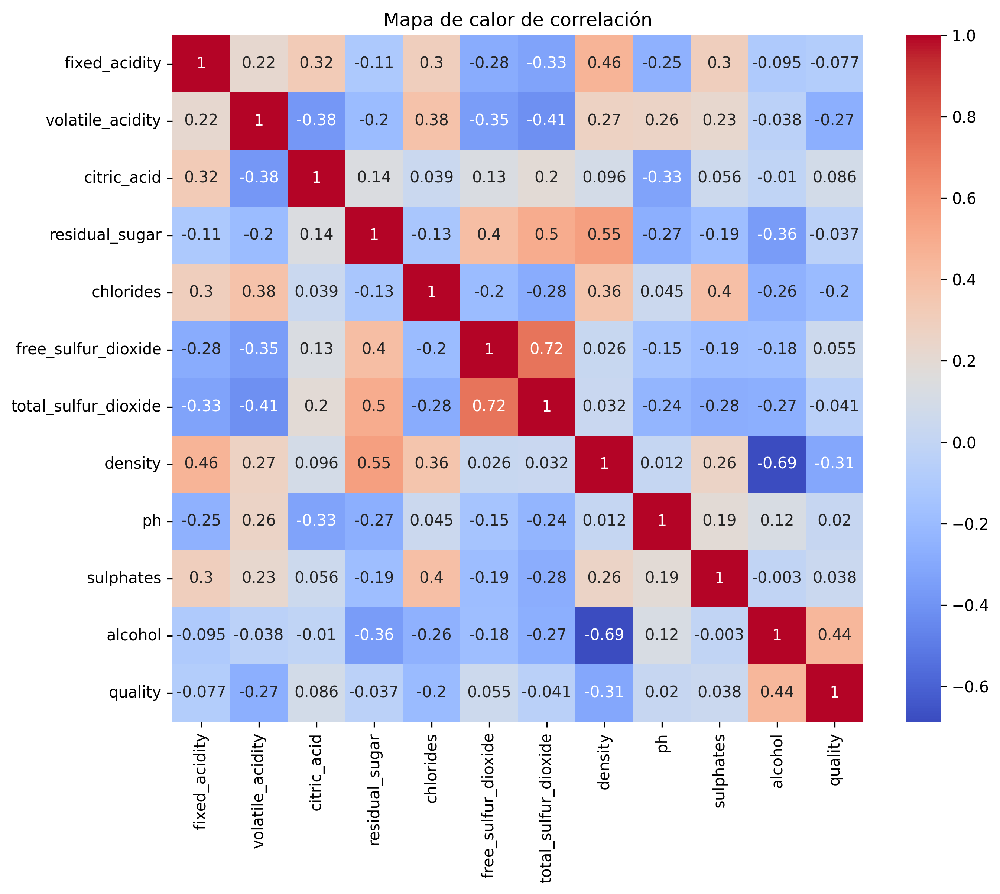

# Examen\_final\_1

## Información del Dataset

* Los datos se relacionan con campañas de marketing directo de una institución bancaria portuguesa. Las campañas se basaron en llamadas telefónicas
  
### Diccionario de Datos

* **fixed acidity**: Acidez fija en g/dm³.
* **volatile acidity**: Acidez volátil en g/dm³.
* **citric acid**: Ácido cítrico en g/dm³.
* **residual sugar**: Azúcar residual en g/dm³.
* **chlorides**: Cloruros en g/dm³.
* **free sulfur dioxide**: Dióxido de azufre libre en mg/dm³.
* **total sulfur dioxide**: Dióxido de azufre total en mg/dm³.
* **density**: Densidad en g/cm³.
* **pH**: Nivel de pH.
* **sulphates**: Sulfatos en g/dm³.
* **alcohol**: Porcentaje de alcohol en % vol.
* **quality**: Calidad del vino (variable objetivo, escala de 0 a 10).

---

## Conclusión del EDA: Vinos White

* Para identificar que todos los datos pertenecen a los vinos blancos, se creó una columna llamada `came` con el valor `'white'`.

* No se observan anomalías evidentes en las estadísticas resumidas.

* En la columna **quality** faltan las clases 1 y 2, lo que puede afectar la predicción de estas calidades en los vinos blancos.

* Existen **937 datos duplicados**, pero se verificó que estos son distintos y funcionales para el análisis del vino.

* Se tomaron algunas columnas para mostrar un histórico de frecuencias y observar los valores más comunes:

  1. **alcohol**: mayor frecuencia entre 9 y 11.
  2. **sulphates**: mayor frecuencia entre 0.4 y 0.6.
  3. **volatile acidity**: mayor frecuencia entre 0.2 y 0.4.
  4. **citric acid**: mayor frecuencia en 0.25.
  5. **pH**: mayor frecuencia entre 3.1 y 3.3.

* En el gráfico boxplot se visualiza la relación entre la calidad del vino y el contenido de alcohol. Se observa que, en general, los vinos blancos de mayor calidad tienden a tener un mayor contenido de alcohol, lo cual podría indicar una correlación positiva entre estos factores.

* Se observa que los vinos con calidad 5 tienden a estar por encima de lo esperado (al igual que en los tintos), mientras que los de calidad 9 son muy pocos y no superan claramente a los de calidad 8.

---

## Conclusión del EDA: Vinos Red

* Para identificar que todos los datos pertenecen a los vinos tintos, se creó una columna llamada `came` con el valor `'red'`.

* No se observan anomalías evidentes en las estadísticas resumidas.

* En la columna **quality** faltan las clases 1, 2 y 9, lo que puede afectar la predicción de estas calidades en los vinos tintos.

* Se identificaron **240 datos duplicados**, los cuales se validaron como distintos y útiles para el análisis.

* Se tomaron algunas columnas para mostrar un histórico de frecuencias y observar los valores más comunes:

  1. **alcohol**: mayor frecuencia entre 9 y 10.
  2. **sulphates**: mayor frecuencia entre 0.50 y 0.75.
  3. **volatile acidity**: mayor frecuencia en 0.6.
  4. **citric acid**: mayor frecuencia en 0.0.
  5. **pH**: mayor frecuencia entre 3.2 y 3.4.

* En el gráfico boxplot se visualiza la relación entre la calidad del vino y el contenido de alcohol. Se observa que, en general, los vinos tintos de mayor calidad tienden a tener un mayor contenido de alcohol, lo cual también sugiere una correlación positiva.

* Se observa que la calidad 5 tiende a estar por encima de lo esperado.

---

## Mapa de Correlación de  Datasets

---

## Conclusión: Modelos de Clasificación

# Conclusion modelos de classificacion 
1. Accuracy knn con GridSearchCV = 0.903
2. Accuracy logisc = 0.887
3. Accuracy tree = 0.908
4. Accuracy forest = 0.908
5. Modelo hiperparámetros XGBOOST =  0.92

El modelo con mejor predicción inicialmente fue Logistic Regression, alcanzando una accuracy de 0.995, lo que indica un desempeño muy alto, pero con cierto margen para mejorar.

Dicha mejora se logró aplicando la optimización de hiperparámetros mediante Optuna al modelo XGBoost, alcanzando una precisión perfecta de 0.92.

  
